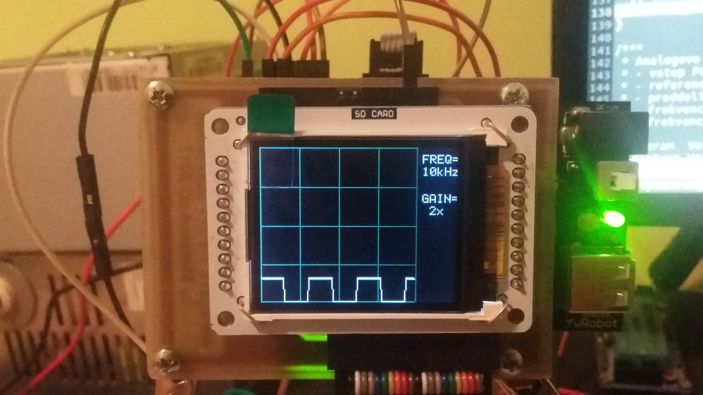
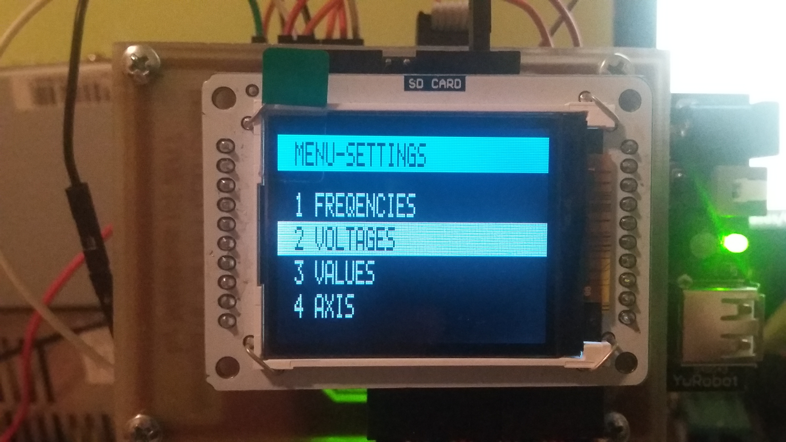
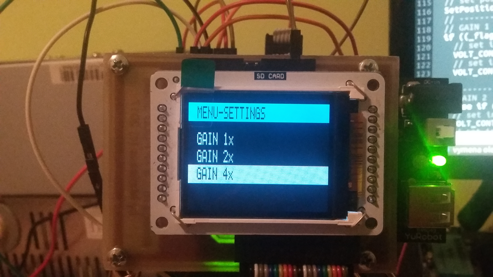
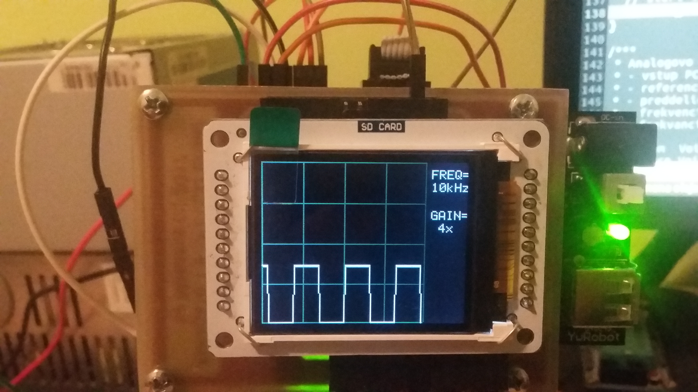
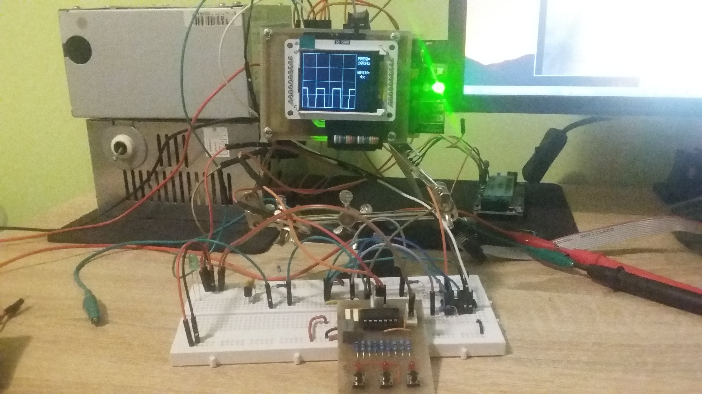

# Oscope - Atmega16
Simple oscilloscope using inbuilt A/D convereter with frequency range settings up to 40 kHz displayed on 1.8 TFT LCD with 162 x 132 pixels.

## Basic description
- **MAX FREQUENCY SAMPLE:**&nbsp;40kHz
- **FREQUENCY RANGE:**&nbsp;1kHz - 40kHz
- **RESOLUTION:**&nbsp;8 bits resolution
- **MEMORY BUFFER:**&nbsp;128 bits

## Demosntration

