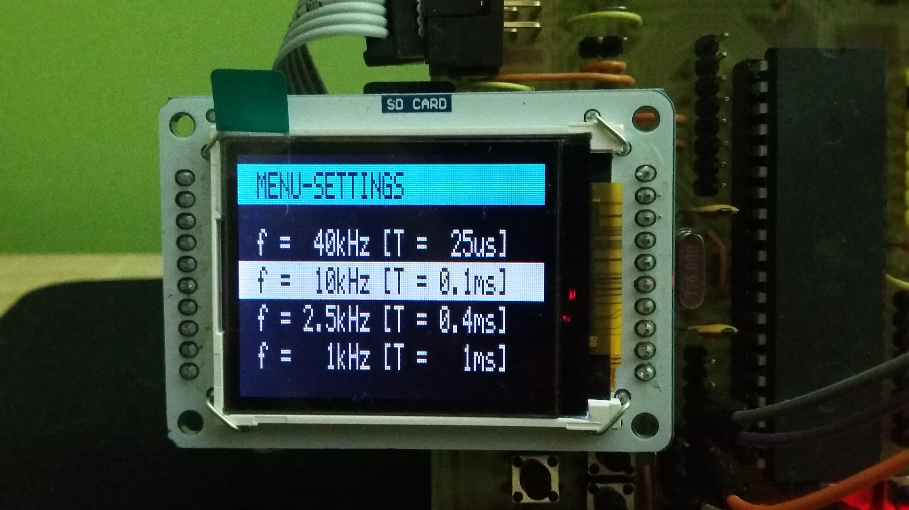

<h1>Oscope - Atmega16</h1>
  
Simple oscilloscope using inbuilt A/D convereter with frequency range settings up to 40 kHz displayed on 1.8 TFT LCD with 162 x 132 pixels.

<h2>Basic description</h2>

  <ul>
    <li><b>MAX FREQUENCY SAMPLE:</b>&nbsp;40kHz</li>
    <li><b>FREQUENCY RANGE:</b>&nbsp;1kHz - 40kHz</li>    
    <li><b>RESOLUTION:</b>&nbsp;8 bits resolution</li>
    <li><b>MEMORY BUFFER:</b>&nbsp;128 bits</li>
  </ul>
<h2>Demosntration</h2>
  

  

  

  

  

